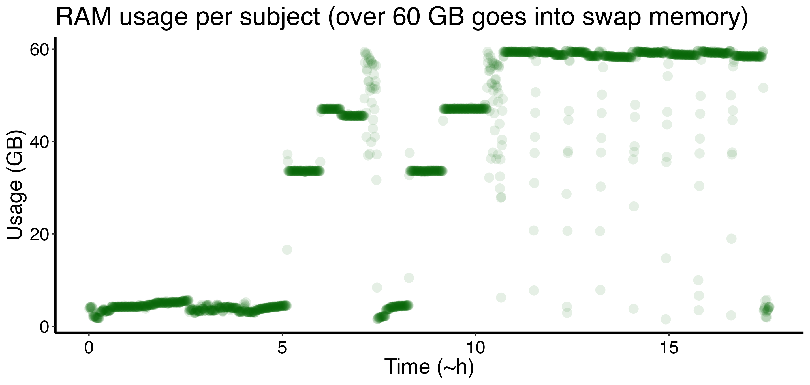
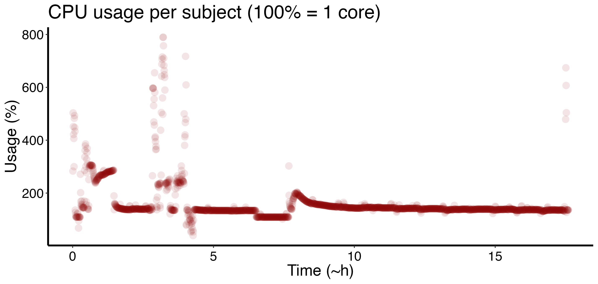
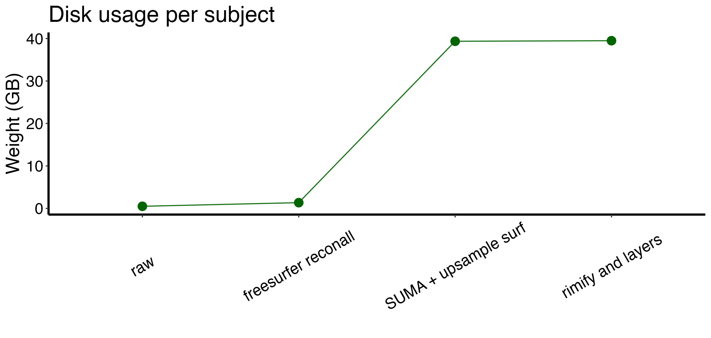

```
    _____________________________________________________________
                                      _    _   _    ____       __
        /                           /      /  /|    /    )     / 
    ---/----__----------__---)__--_/__----/| /-|---/___ /-----/--
      /   /   ) /   / /___) /   ) /      / |/  |  /    |     /    
    _/___(___(_(___/_(___ _/_____/______/__/___|_/_____|__ _/_ __
                  /                                              
    __________(_ /_______________________________________________
```


# layerfMRI-toolbox v0.1.0 - BETA*

(*) new commits will break the code very often

This is a bash/matlab/ctave toolbox to perform layerfMRI preprocessing analyses using wrapper functions for common MRI software analyses. There are examples of how to streamline a pipeline but it is also easy to plug in at any point your custom code for your analyses tailored to your specific project/data.

The layerfMRI-toolbox helps with two main streams of data analyses:

1. Tissue segmentation and layerification of anatomical data (MP2RAGE)

* Prepare (`presurfer`) and segment (`freesurfer`) and anatomical using a high resolution `MP2RAGE` anatomical image
* Prepare a high-quality rim file (WM, GM, and pial masks) for layeryfication (`SUMA`) and overcome kissing gyri problem. Visual check og the quality of the outcome is recommended and manual editig might be needed.
* (optional for functional MRI projects) Coregister the rim file to EPI distorde space (`ANTs`)
* Create layers mask segmentation (`LAYNII`)
  
2. [WIP - available in the future] Vaso time series preprocessing

* Apply thermal noise-cleaning on VASO data (`NORDIC`)
* Preprocess VASO data (motion correction `AFNI`; bold correction `LAYNII`, T1w image from `nulled` contrast `AFNI`)
* Quality metrics (`LAYNII`) as tSNR, noise distribution etc.

## Philosophy of the pipeline

1. Everyone is welcome to contribute.
2. This is the only way to analyze layer fMRI data. It is one way of many, we just want to make it easier and faster.
3. If you have a different and cool way to tackle a particular step, please make it available for everyone adding it to this repo. 
4. This pipeline is a transparent box. We keep it easy so that everyone can easily open the scripts and look at what is happening inside and contribute.
5. Each called "function" has an input and an output and should do just one operation/step on the data.
6. The pipeline is made of modules that can be ordered in a different way. The example demo is just an example that suits the dummy data. In your paradigm, you may have slightly different things that may benefit from eg a different steps order or custom code. Just get inspired.

## Contributors

- Marco Barilari
- Kenshu Koiso
- Paul A. Taylor
- Omer Faruk Gulban Taylor
- Daniel Glen
- Peter Bandettini
- Olivier Collignon
- Renzo Huber
- et al. ... if you think your name is missing, please do not hesitate to reach out

## TOC
- [layerfMRI-toolbox v0.1.0 - BETA\*](#layerfmri-toolbox-v010---beta)
  - [Philosophy of the pipeline](#philosophy-of-the-pipeline)
  - [Contributors](#contributors)
  - [TOC](#toc)
  - [Installation](#installation)
    - [Requirements](#requirements)
      - [Softwares](#softwares)
      - [Other requirments](#other-requirments)
    - [Automatic by creating the ideal project folder structure (aka a YODA folder):](#automatic-by-creating-the-ideal-project-folder-structure-aka-a-yoda-folder)
    - [Cloning a template with ideal project folder structure (aka a YODA folder) and DATALAD:](#cloning-a-template-with-ideal-project-folder-structure-aka-a-yoda-folder-and-datalad)
    - [Manual](#manual)
  - [How to use it](#how-to-use-it)
    - [Data input format](#data-input-format)
    - [Demos](#demos)
  - [Benchmarking](#benchmarking)
    - [From high-res anatomical to whole brain layers](#from-high-res-anatomical-to-whole-brain-layers)
  - [TO DO: looking for contributions](#to-do-looking-for-contributions)
  - [Ideal structure of the derivatives (see demos):](#ideal-structure-of-the-derivatives-see-demos)

## Installation

### Requirements

#### Softwares

- Presurfer (included as submodule) commit ad236b7
- Matlab/Octave with SPM12
- Freesurfer v7.3.0 or higher
- AFNI v24.0.16 or higher
- LAYNII v2.3.0 or higher
- ANTS 2.3.4 or higher

A docker image is WIP

#### Other requirments

- A good computer (better if it is a crunch computer or a cluster)
- Basic experience with Bash scripting
- Lots of patience :) (tips: most of the time is just a path problem)

Tested on Linux (Ubuntu 22.04.5 LTS) and Apple Intel (Monterey)/Silicon Mac

### Automatic by creating the ideal project folder structure (aka a [YODA folder](https://handbook.datalad.org/en/latest/basics/101-127-yoda.html)):

Download [this script](https://github.com/marcobarilari/layerfMRI-toolbox/blob/main/src/utils/make_yoda_layerfMRI-toolbox.sh) and run it as follow:

```bash
bash path/to/make_yoda_layerfMRI-toolbox.sh \
  my_folder_project_name \
  where/I/want/to/create/it
```

This is the expected folder structure
```bash
# output structure

`analyses_layerfMRI_your-project-name`
    .
    ├── code
    │   ├── lib # where layerfMRI-toolbox lives
    │   ├── src # where your code and the batch file to run layerfMRI-toolbox live
    ├── inputs
    │   └── raw # your awesome raw dataset + other input to not touch, ideally bidslike format
    └── outputs
        └── derivates # where any processed file will be saved in separate subfolders named by `software-step` 
```

### Cloning a template with ideal project folder structure (aka a YODA folder) and DATALAD:

Use the GitHub template [template_layerfMRI-toolbox_yoda](https://github.com/marcobarilari/template_layerfMRI-toolbox_yoda), it has already this toolbox installed

1. From the link above, click on `Use this template`, green button (up-right)
2. Set your project/repo name
3. Clone on your computer your new project repository as

> [!IMPORTANT]  
> `--recursive` flag is very important!

```bash
cd where/you/want/to/save/the/repo

git clone --recursive your/repo/url # --recursive flag is very important!
```

4. Populate the repo with data a custom code and use datalad to save and push (e.g. to [GIN](https://handbook.datalad.org/en/latest/basics/101-139-gin.html)) your derivatives
5. Check you have all the requirements listed in this README file

### Manual

1. Add this repo to your analysis project folder

> [!IMPORTANT]  
> `--recursive` flag is very important!

```bash
git clone --recursive https://github.com/marcobarilari/layerfMRI-toolbox.git
```

1. Check you have all the requirements listed in this README file
2. Check the config file `config_layerfMRI_pipeline.sh` and modify it according to your software paths.
3. Check the demos for suggested pipelines in the `batch demos` (and check paths there as well if you intend to use them).

## How to use it

Check the demos to se how to set up the batch script to streamline all the steps. The main suggestion is to run one subject at the time as the resources required (i.e. RAM) in some steps may be too demanding for subject parallelization.

### Data input format

Nifti files, better if bids-like format. 

### Demos

check the `batch_demos` folder showing how to stremline the whole tissue segmentation and layer definition in volume space.

## Benchmarking

The demo has been run on a crunching computer (cpp-labMONSTER):

- Linux 6.2.0-36-generic #37~22.04.1-Ubuntu
- 24 CPUs (Intel(R) Xeon(R) Gold 5118 CPU @ 2.30GHz)
- 64GB ram + 200GB swap memory

RAM and CPU usage are sampled every ~30 seconds.

### From high-res anatomical to whole brain layers

This section refers to the demo `layerfMRI_pipeline_segment-layers.sh` using a high-res anatomical MP2RAGE whole brain (0.75 mm iso) and T1w in EPI space derived from vaso functional data of a specific task experiment (0.75 mm iso, partial brain coverage).







CONCLUSION: It will hit hard on the memory (RAM or swap). To increase swap memory in Linux check here xxx. Windows and Mac should be already configured to ~~steal memory to the HD~~ increase the swap automatically if the RAM is full.

## TO DO: looking for contributions

- Improvements in the current method
- Add alternative methods
- Add better documentation + educational material
- Write tests

## Ideal structure of the derivatives (see demos):

see [WIP-folder_organization](WIP-folder_organization.md) and provide feedbacks. Thinking about multiple options atm.


